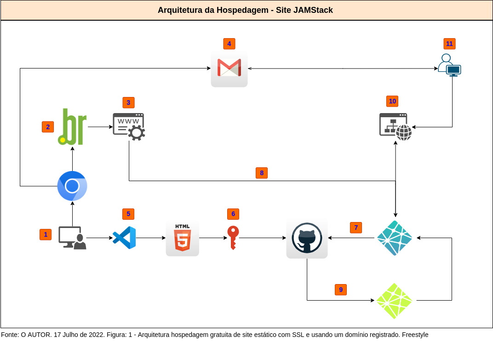
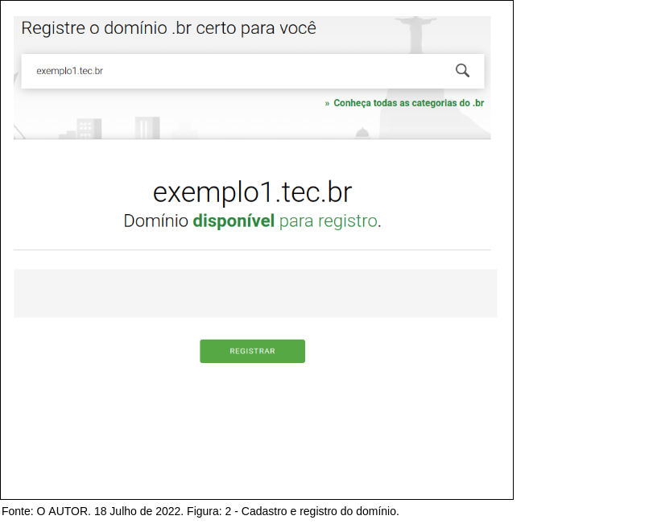
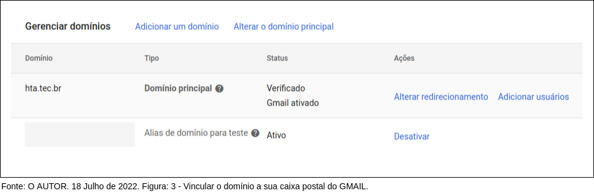

# Arquitetura de um site JAMStack

### A Jamstack é uma arquitetura criada para construir estáticos.

### Objetivos

Este documento foi elaborado, com informações básicas sobre como você pode hospedar um site estático, com domínio próprio sem custo de hospedagem, usando Netlify Drop integrado ao Github.

No final desta jornada, teremos uma arquitetura de um site JAMStack, diferente de sites que utilizam um servidor backend tradicional. Nosso site estará hospedado e integrado ao Github, onde você poderá apresentar seus portfólios de trabalhos ou estudos acadêmicos, usando o seu domínio personalizado e com SSL grátis.

### Restrições

- Hospedagem para arquivos HTML, CSS e Javascript;
- Suporte para projetos em ReactJS ou similares;
- Suporte para entrega contínua e/ou à implantação contínua com GitHub (CI/CD).

### Considerações iniciais

Existem várias arquiteturas e possibilidades de hospedagens gratuitas, este documento é mais uma das proposições (sugestões), dentre as excelentes soluções que existem na Internet.

Neste exemplo os arquivos (fontes) HTML, CSS e imagens foram hospedagas no GitHub, e o domínio foi registrado no Registro.br, que é o departamento do NIC.br responsável pelas atividades de registro e manutenção dos nomes de domínios que usam o .br.

### Pré-requisitos

- Registrar ou ter um nome de domínio registrado;
- Acesso administrativo para realizar configurações personalizadas nos serviços de DNS do domínio;
- Cadastro no GitHub (https://github.com/);
- Cadastro no Netlify (https://www.netlify.com)

### Introdução

JAMStack (sites estáticos) é uma técnica para criar sites e aplicativos que oferecem bom desempenho, segurança e excelente custo de escala.

Arquitetura JAMStack consiste em sites com a seguinte estrutura:

- JavaScript
- APIs
- Marcação

Com o JAMStack o HTML é exibido sem a necessidade de renderizar informações de um servidor "backend" (retaguarda), com isso, o tempo de carregamento é rápido.

Segue abaixo arquitetura "sintética" para a esta jornada, de forma breve vou descrever a seguir os passos de 1 a 11 necessários, com exemplos, para a reprodução deste experimento.



### [1-3] Registro domínio

Não é obrigatório criar um domínio. No meu caso, eu registrei o domínio HTA.TEC.BR, porque faz parte do escopo do meu projeto. Para criar e registrar um domínio, primeiro você precisa cadastrar-se no site REGISTRO.BR, depois escolher o nome do domínio e em seguida, efetivar o registro, ou seja, pagar pelo registro. Mais detalhes dos processos visite o site Registro.BR: [Regras para registro de domínios .BR](https://registro.br/dominio/regras/)



### [4] Criar uma conta de e-mail

Novamente, não é obrigatório criar uma conta de e-mail. Criei uma conta no GMail, porque pretendemos usar o serviço de caixa postal gratuito vinculado ao domínio HTA.TEC.BR para a nossa comunicação. Mais detalhes visite: [Criar contas no GMAIL](https://support.google.com/mail/answer/56256?hl=pt-BR) e [Vincular o domínio próprio no GMAIL](https://support.google.com/a/answer/140034?hl=pt-BR).



```python

```

(em desenvolvimento)

```python

```

### Referências:

[1] CI/CD - [https://www.redhat.com](https://www.redhat.com/pt-br/topics/devops/what-is-ci-cd)<br>
[2] HTML5 - [https://pt.wikipedia.org](https://pt.wikipedia.org/wiki/HTML5)<br>
[3] W3 - [https://www.w3.org/](https://www.w3.org/)<br>
[4] ReactJS - [https://pt-br.reactjs.org/](https://pt-br.reactjs.org/)<br>
[5] GitHub - [https://github.com/](https://github.com/)<br>
[6] .BR - [https://registro.br/](https://registro.br/)<br>
[7] DNS - [https://pt.wikipedia.org](https://pt.wikipedia.org/wiki/Sistema_de_Nomes_de_Dom%C3%ADnio)<br>
[8] Netlify - [https://app.netlify.com](https://app.netlify.com/drop)<br>
[9] JAMStact - [https://en.wikipedia.org](https://en.wikipedia.org/wiki/Jamstack)

```python

```
